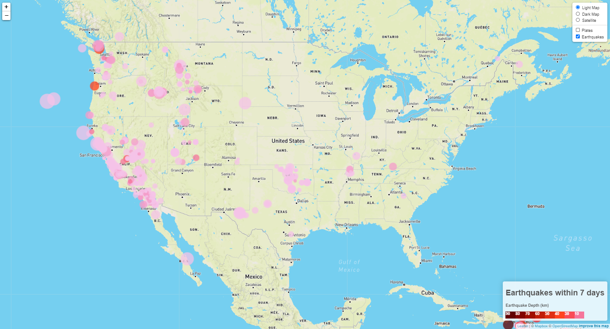

# Leaflet Challenge - Visualizing Data with Leaflet

## Background

Welcome to the United States Geological Survey, or USGS for short! The USGS is responsible for providing scientific data about natural hazards, the health of our ecosystems and environment; and the impacts of climate and land-use change. Their scientists develop new methods and tools to supply timely, relevant, and useful information about the Earth and its processes. As a new hire, you will be helping them out with an exciting new project!

The USGS is interested in building a new set of tools that will allow them visualize their earthquake data. They collect a massive amount of data from all over the world each day, but they lack a meaningful way of displaying it. Their hope is that being able to visualize their data will allow them to better educate the public and other government organizations (and hopefully secure more funding..) on issues facing our planet.

## Earthquake Visualization

### In this challenge, earthquake data was visualized using Leaflet Mapbox.

1. **Get your data set**

   

   The USGS provides earthquake data in a number of different formats, updated every 5 minutes. Visit the [USGS GeoJSON Feed](http://earthquake.usgs.gov/earthquakes/feed/v1.0/geojson.php) page and pick a data set to visualize.
   Dataset picked: "All earthquakse from the past 7 days. https://earthquake.usgs.gov/earthquakes/feed/v1.0/summary/all_week.geojson

   A JSON representation of that data is available [here](https://earthquake.usgs.gov/earthquakes/feed/v1.0/summary/all_week.geojson) This URL with JSON was used to pull in the data for the visualization.

   

2. **Import & Visualize the Data**

   Created a map using Leaflet that plots all of the earthquakes from the data set based on their longitude and latitude.

   * Data markers reflect the magnitude of the earthquake by their size and and depth of the earth quake by color. Earthquakes with higher magnitudes appear larger and earthquakes with greater depth appear darker in color.

   * The depth of the earthquake can be found as the third coordinate for each earthquake.

   * Earthquake details are shown when the marker is clicked. The popups provide additional information about the earthquake.

   * Legend added that provides context for your map data.

- - -

### Tectonic Plates and Layers

The USGS wants you to plot a second data set on your map to illustrate the relationship between tectonic plates and seismic activity. You will need to pull in a second data set and visualize it along side your original set of data. Data on tectonic plates can be found at <https://github.com/fraxen/tectonicplates>.

In this section:

* Plotted a second data set onto map.

* Added base maps (light, dark, satellite) to choose from as well as separated out the two different data sets (earthquakes and tectonic plages) into overlays that can be turned on and off independently.

* Added layer controls to map.

- - -

